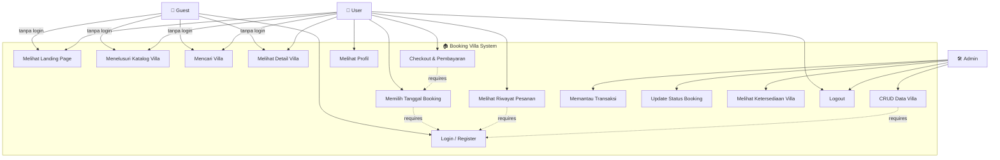
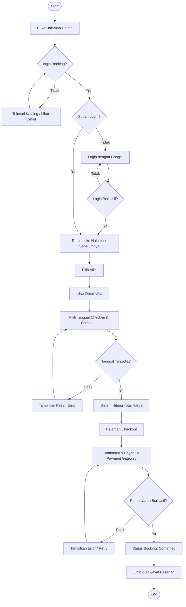
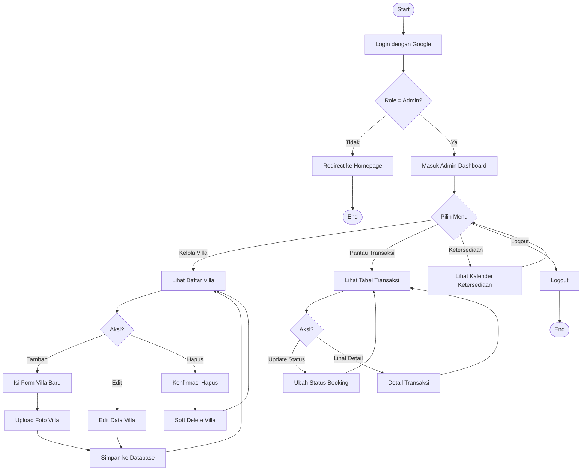

# 📘 AGENTS.md — Booking Villa (Umbu Houses)

> **Project:** Booking Villa — Umbu Houses
> **Repository:** [liv-lauflove/booking-villa](https://github.com/liv-lauflove/booking-villa)
> **Stack:** Next.js 16 · React 19 · Tailwind CSS 4 · Prisma · NextAuth v5 (Auth.js) · TypeScript
> **Database:** PostgreSQL (Supabase)
> **Referensi Tutorial:** [Buat Booking App MODERN dari 0 dengan Next.js (Full Tutorial!)](https://youtu.be/Phj_oT5FaDI)

---

## 📋 Daftar Isi

1. [Gambaran Umum Project](#1-gambaran-umum-project)
2. [Alur Kerja Development (dari Tutorial)](#2-alur-kerja-development-dari-tutorial)
3. [GitHub Issues & Milestones (Progress Tracking)](#3-github-issues--milestones-progress-tracking)
4. [Status Progress Saat Ini](#4-status-progress-saat-ini)
5. [Branching Strategy](#5-branching-strategy)
6. [Struktur Folder (Rekomendasi Next.js)](#6-struktur-folder-rekomendasi-nextjs)
7. [ERD (Entity Relationship Diagram)](#7-erd-entity-relationship-diagram)
8. [Use Case Diagram](#8-use-case-diagram)
9. [Activity Diagram — User](#9-activity-diagram--user)
10. [Activity Diagram — Admin](#10-activity-diagram--admin)
11. [Penjelasan Fitur (Do's & Don'ts)](#11-penjelasan-fitur-dos--donts)
12. [Hal yang Harus Diperbaiki](#12-hal-yang-harus-diperbaiki)
13. [Konvensi Kode](#13-konvensi-kode)

---

## 1. Gambaran Umum Project

**Umbu Houses** adalah aplikasi web booking villa modern yang memungkinkan pengguna menelusuri katalog villa, melakukan reservasi dengan date picker, dan membayar melalui payment gateway. Admin dapat mengelola data villa dan memantau transaksi melalui dashboard khusus.

### Fitur Utama

| Fitur | Deskripsi |
|---|---|
| 🏠 Landing Page | Hero section, about us, rekomendasi villa, reviews, footer |
| 🔐 Autentikasi | Google OAuth via NextAuth v5, role-based (User/Admin) |
| 🏡 Katalog Villa | Halaman daftar villa dengan search & filter |
| 📅 Detail & Booking | Galeri foto, date picker, validasi ketersediaan, hitung harga |
| 💳 Checkout & Payment | Integrasi payment gateway (Stripe/Midtrans) |
| 👤 User Dashboard | Riwayat pesanan, profil |
| 🛠️ Admin Dashboard | CRUD villa, pantau transaksi, kelola ketersediaan |

---

## 2. Alur Kerja Development (dari Tutorial)

Referensi: [YouTube — Buat Booking App MODERN dari 0 dengan Next.js](https://youtu.be/Phj_oT5FaDI)

Tutorial ini membangun aplikasi booking hotel/villa dari nol dengan Next.js. Berikut urutan tahapan development yang disarankan:

### Tahap 1 — Foundation & Setup
- Inisialisasi project Next.js (`create-next-app`)
- Setup Tailwind CSS & design system (color tokens, typography)
- Setup Prisma ORM & koneksi database
- Buat schema database (User, Villa, Reservation, Payment, dll)
- Jalankan migration pertama

### Tahap 2 — Autentikasi & Role Management
- Setup NextAuth v5 (Auth.js) dengan Google Provider
- Konfigurasi Prisma Adapter
- Implementasi JWT strategy dengan role di token
- Type augmentation `next-auth.d.ts`
- Buat halaman Sign In
- Proteksi route admin (middleware/layout)

### Tahap 3 — UI Halaman Utama (Landing Page)
- Navbar (responsive, mobile menu)
- Hero Section (gambar latar, CTA)
- About Us Section
- Rekomendasi Villa Section
- Reviews Section
- Footer (kontak, sosial media)

### Tahap 4 — Admin Dashboard
- Layout admin (sidebar, navigation)
- CRUD Data Villa (Create, Read, Update, Delete)
- Upload galeri foto villa
- Tabel daftar villa

### Tahap 5 — Katalog & Detail Villa
- Halaman `/villas` — grid/list card villa
- Search bar & filter
- Halaman `/villa/[id]` — detail villa
- Galeri foto villa
- Date Picker & kalender ketersediaan
- Kalkulasi harga otomatis

### Tahap 6 — Checkout & Payment
- Halaman checkout (ringkasan pesanan)
- Integrasi payment gateway (Stripe / Midtrans)
- Webhook untuk update status pembayaran
- Konfirmasi booking otomatis

### Tahap 7 — User Dashboard
- Halaman profil pengguna
- Riwayat pesanan (booking history)
- Status pembayaran per pesanan

### Tahap 8 — Admin Monitoring
- Pantauan transaksi (tabel seluruh pesanan)
- Update status booking manual
- Ikhtisar ketersediaan villa

### Tahap 9 — Deployment
- Konfigurasi environment variables production
- Deploy ke Vercel
- Koneksi database production (Supabase)

---

## 3. GitHub Issues & Milestones (Progress Tracking)

### Milestones

| Milestone | Deskripsi | Status |
|---|---|:---:|
| **M1: Core System & Auth** | Setup project, database, autentikasi | 🟡 In Progress |
| **M2: Admin Dashboard & Villa Management** | CRUD data villa, kelola pesanan | 🔴 Not Started |
| **M3: User Interface & Booking Logic** | Landing page, katalog, detail, date picker | 🔴 Not Started |
| **M4: Payment & Checkout** | Integrasi payment gateway | 🔴 Not Started |
| **M5: User Area** | Dashboard user, riwayat pesanan, profil | 🔴 Not Started |

### Issues

| # | Issue | Milestone | Labels | Status |
|---|---|---|---|:---:|
| #3 | [Feature] Setup Autentikasi dan Role User/Admin | M1: Core System & Auth | `feature`, `high`, `frontend`, `backend`, `admin-dashboard` | 🟡 In Progress |
| #10 | feat: Migrate Database to Supabase PostgreSQL | — | — | 🟡 Open |
| #2 | [Feature] Manajemen CRUD Data Villa (Admin Dashboard) | M2: Admin Dashboard | `feature`, `high`, `frontend`, `backend`, `admin-dashboard` | 🔴 Open |
| #7 | [Feature] Pantauan Transaksi & Manajemen Ketersediaan | M2: Admin Dashboard | `feature`, `high`, `frontend`, `backend`, `admin-dashboard` | 🔴 Open |
| #8 | [Feature] Halaman Utama (Landing Page) | M3: User Interface | `feature`, `high`, `frontend`, `user-booking` | 🟡 In Progress |
| #9 | [Feature] Halaman Katalog & Fitur Pencarian Villa | M3: User Interface | `feature`, `high`, `frontend`, `backend`, `user-booking` | 🔴 Open |
| #4 | [Feature] Detail Villa & Logika Booking (Date Picker) | M3: User Interface | `feature`, `high`, `frontend`, `backend`, `user-booking` | 🔴 Open |
| #5 | [Feature] Integrasi Payment Gateway & Checkout | M4: Payment & Checkout | `feature`, `high`, `frontend`, `backend`, `payment` | 🔴 Open |
| #6 | [Feature] User Dashboard (Riwayat Pesanan & Profil) | M5: User Area | `feature`, `medium`, `frontend`, `user-booking` | 🔴 Open |

---

## 4. Status Progress Saat Ini

> **Project saat ini berada di tahap: Autentikasi & Landing Page (Issue #3 & #8)**

### ✅ Yang Sudah Selesai

- [x] Inisialisasi project Next.js 16 dengan TypeScript
- [x] Setup Tailwind CSS 4 + PostCSS
- [x] Setup shadcn/ui (komponen Button)
- [x] Setup Prisma schema (Villa, Amenities, Reservation, Payment, User, Account)
- [x] Migration pertama ke database
- [x] Migrasi datasource ke PostgreSQL (Supabase) — Issue #10
- [x] Setup NextAuth v5 dengan Google Provider
- [x] Konfigurasi Prisma Adapter
- [x] JWT callback dengan role dari database
- [x] Type augmentation `next-auth.d.ts` (User.role, JWT.role)
- [x] API route `/api/auth/[...nextauth]`
- [x] Halaman Sign In (`/SignIn`) dengan Google button
- [x] Proteksi route admin via server-side layout
- [x] Prisma client singleton (`lib/prisma.ts`)
- [x] Utility function `cn()` (`lib/utils.ts`)
- [x] Design system — color tokens (light + dark theme) di `globals.css`
- [x] Komponen Navbar (responsive + mobile menu + animasi)
- [x] Komponen Hero Section (background image + CTA + animasi)
- [x] Komponen About Us (image carousel + deskripsi)
- [x] Komponen Recommended Villas (card grid + animasi)
- [x] Komponen Reviews (rating stars + testimonial cards)
- [x] Komponen Footer (kontak + social media)
- [x] Halaman admin placeholder (`/admin`) dengan proteksi role

### 🟡 Sebagian Selesai (Perlu Perbaikan)

- [ ] Issue #3 — Auth: Sign In page URL case mismatch (`/SignIn` vs `/signin`), build error type mismatch
- [ ] Issue #8 — Landing Page: komponen dasar ada tapi data masih hardcoded/dummy, gambar villa placeholder

### 🔴 Belum Dimulai

- [ ] Issue #2 — CRUD Data Villa (Admin Dashboard)
- [ ] Issue #7 — Pantauan Transaksi & Manajemen Ketersediaan
- [ ] Issue #9 — Halaman Katalog & Pencarian Villa
- [ ] Issue #4 — Detail Villa & Logika Booking (Date Picker)
- [ ] Issue #5 — Integrasi Payment Gateway & Checkout
- [ ] Issue #6 — User Dashboard (Riwayat Pesanan & Profil)
- [ ] Route `/villas` (halaman belum dibuat, hanya ada link)
- [ ] Route `/reservations` (halaman belum dibuat, hanya ada link)
- [ ] Middleware auth (`middleware.ts`)
- [ ] Halaman error (`error.tsx`, `not-found.tsx`, `loading.tsx`)
- [ ] Dark mode toggle
- [ ] Deployment

---

## 5. Branching Strategy

Setiap issue dikerjakan di branch terpisah. Format penamaan branch:

```
<type>/<issue-number>-<deskripsi-singkat>
```

### Contoh Branch per Issue

| Issue | Branch Name | Base Branch |
|---|---|---|
| #3 Setup Auth & Role | `feat/3-auth-role-setup` | `dev` |
| #10 Migrate DB | `feat/10-migrate-supabase` | `dev` |
| #8 Landing Page | `feat/8-landing-page` | `dev` |
| #2 CRUD Villa | `feat/2-crud-villa-admin` | `dev` |
| #7 Pantauan Transaksi | `feat/7-admin-transaction` | `dev` |
| #9 Katalog Villa | `feat/9-villa-catalog` | `dev` |
| #4 Detail & Booking | `feat/4-detail-booking` | `dev` |
| #5 Payment Gateway | `feat/5-payment-checkout` | `dev` |
| #6 User Dashboard | `feat/6-user-dashboard` | `dev` |

### Tipe Branch

| Prefix | Kegunaan | Target Merge |
|---|---|---|
| `feat/` | Fitur baru | → `dev` |
| `fix/` | Perbaikan bug | → `dev` |
| `refactor/` | Refactoring kode tanpa perubahan fungsionalitas | → `dev` |
| `docs/` | Dokumentasi | → `dev` |
| `chore/` | Konfigurasi, dependency, tooling | → `dev` |

### Alur Kerja Git

```
main ──────────────────────────────────────────────► production (stable release)
  ▲
  │ PR (release merge)
  │
dev ───────────────────────────────────────────────► development (integration)
  │
  ├── feat/3-auth-role-setup ──► PR ──► merge ke dev
  ├── feat/8-landing-page ─────► PR ──► merge ke dev
  ├── feat/2-crud-villa-admin ─► PR ──► merge ke dev
  └── ...
```

1. Buat branch baru dari `dev`
2. Kerjakan fitur sesuai issue
3. Commit dengan format: `feat(#3): implement google oauth login`
4. Buat Pull Request ke `dev`
5. Review & merge ke `dev`
6. Setelah fitur stabil dan teruji di `dev`, merge `dev` ke `main` untuk release production

---

## 6. Struktur Folder (Rekomendasi Next.js)

Berdasarkan [dokumentasi resmi Next.js](https://nextjs.org/docs/app/getting-started/project-structure), berikut struktur folder yang disarankan untuk project ini:

```
booking-villa/
├── app/                          # App Router (routing only)
│   ├── (main)/                   # Route group — public pages
│   │   ├── layout.tsx            # Layout utama (Navbar + Footer)
│   │   ├── page.tsx              # Landing page (/)
│   │   ├── villas/
│   │   │   ├── page.tsx          # Katalog villa (/villas)
│   │   │   └── [id]/
│   │   │       └── page.tsx      # Detail villa (/villas/[id])
│   │   └── reservations/
│   │       └── page.tsx          # Riwayat reservasi (/reservations)
│   │
│   ├── (auth)/                   # Route group — auth pages
│   │   ├── layout.tsx            # Layout auth (centered, minimal)
│   │   └── signin/
│   │       └── page.tsx          # Halaman sign in (/signin)
│   │
│   ├── admin/                    # Admin dashboard (protected)
│   │   ├── layout.tsx            # Layout admin (sidebar + nav)
│   │   ├── page.tsx              # Dashboard overview (/admin)
│   │   └── villas/
│   │       ├── page.tsx          # Daftar villa (/admin/villas)
│   │       ├── create/
│   │       │   └── page.tsx      # Tambah villa (/admin/villas/create)
│   │       └── [id]/
│   │           └── edit/
│   │               └── page.tsx  # Edit villa (/admin/villas/[id]/edit)
│   │
│   ├── api/                      # API Routes
│   │   └── auth/
│   │       └── [...nextauth]/
│   │           └── route.ts      # NextAuth handler
│   │
│   ├── layout.tsx                # Root layout (html, body, fonts)
│   ├── globals.css               # Global styles & design tokens
│   ├── loading.tsx               # Global loading state
│   ├── not-found.tsx             # 404 page
│   └── error.tsx                 # Error boundary
│
├── components/                   # Shared React components
│   ├── ui/                       # shadcn/ui primitives (Button, Input, dll)
│   ├── layout/                   # Layout components
│   │   ├── Navbar.tsx
│   │   └── Footer.tsx
│   ├── landing/                  # Landing page sections
│   │   ├── Hero.tsx
│   │   ├── AboutUs.tsx
│   │   ├── RecommendedVillas.tsx
│   │   └── Reviews.tsx
│   ├── villa/                    # Villa-related components
│   │   ├── VillaCard.tsx
│   │   ├── VillaGallery.tsx
│   │   └── DatePicker.tsx
│   ├── admin/                    # Admin-specific components
│   │   ├── VillaForm.tsx
│   │   └── TransactionTable.tsx
│   └── auth/                     # Auth components
│       └── LoginButton.tsx
│
├── lib/                          # Utilities & shared logic
│   ├── prisma.ts                 # Prisma client singleton
│   ├── utils.ts                  # Utility functions (cn, dll)
│   └── actions/                  # Server Actions
│       ├── villa.ts              # Villa CRUD actions
│       ├── booking.ts            # Booking actions
│       └── payment.ts            # Payment actions
│
├── hooks/                        # Custom React hooks
│   └── use-debounce.ts
│
├── types/                        # TypeScript type definitions
│   └── next-auth.d.ts            # NextAuth type augmentation
│
├── prisma/                       # Prisma ORM
│   ├── schema.prisma             # Database schema
│   └── migrations/               # Migration files
│
├── public/                       # Static assets
│   └── images/
│       └── hero.jpg
│
├── auth.ts                       # NextAuth configuration
├── middleware.ts                  # Next.js middleware (auth protection)
├── next.config.ts                # Next.js configuration
├── package.json
├── tsconfig.json
├── eslint.config.mjs
├── postcss.config.mjs
├── components.json               # shadcn/ui config
├── .prettierrc
├── .gitignore
├── .env.local                    # Environment variables (not committed)
└── AGENTS.md                     # This file
```

### Catatan Penting Struktur Folder

- **Route Groups `(main)` dan `(auth)`**: Digunakan untuk mengelompokkan halaman dengan layout berbeda tanpa mempengaruhi URL.
- **`components/` di root**: Mengikuti pola Next.js "store project files outside of `app`" — `app/` hanya untuk routing.
- **`lib/actions/`**: Server Actions diletakkan terpisah agar reusable di berbagai komponen.
- **`middleware.ts`**: File khusus Next.js di root untuk intercept request (auth protection).
- **Special files**: `loading.tsx`, `error.tsx`, `not-found.tsx` harus ada untuk UX yang baik.

---

## 7. ERD (Entity Relationship Diagram)

```mermaid
erDiagram
    User ||--o{ Account : "has"
    User ||--o{ Reservation : "makes"
    Villa ||--o{ Reservation : "booked in"
    Villa ||--o{ VillaAmenities : "has"
    Amenity ||--o{ VillaAmenities : "belongs to"
    Reservation ||--o| Payment : "paid via"

    User {
        string id PK
        string name
        string email UK
        datetime emailVerified
        string image
        string role "default: user"
        string phone
        datetime createdAt
        datetime updatedAt
    }

    Account {
        string userId FK
        string type
        string provider PK
        string providerAccountId PK
        string refresh_token
        string access_token
        int expires_at
        string token_type
        string scope
        string id_token
        string session_state
        datetime createdAt
        datetime updatedAt
    }

    Villa {
        string id PK
        string name
        string description
        string image
        int price
        int capacity "default: 1"
        datetime createdAt
        datetime updatedAt
    }

    Amenity {
        string id PK
        string name
        datetime createdAt
        datetime updatedAt
    }

    VillaAmenities {
        string id PK
        string villaId FK
        string amenitiesId FK
    }

    Reservation {
        string id PK
        datetime startDate
        datetime endDate
        int price
        string userId FK
        string villaId FK
        datetime createdAt
        datetime updatedAt
    }

    Payment {
        string id PK
        string method
        int amount
        string status "default: unpaid"
        string reservationId FK_UK
        datetime createdAt
        datetime updatedAt
    }
```

---

## 8. Use Case Diagram



### Aktor

| Aktor | Deskripsi |
|---|---|
| **Guest** | Pengunjung yang belum login. Bisa melihat landing page, katalog, detail villa. |
| **User** | Pengguna yang sudah login. Bisa melakukan booking dan melihat riwayat. |
| **Admin** | Administrator. Mengelola data villa dan memantau transaksi. |

---

## 9. Activity Diagram — User



---

## 10. Activity Diagram — Admin



---

## 11. Penjelasan Fitur (Do's & Don'ts)

### 🔐 Fitur: Autentikasi (Issue #3)

| ✅ Do's | ❌ Don'ts |
|---|---|
| Gunakan NextAuth v5 (Auth.js) dengan JWT strategy | Jangan simpan password di database (pakai OAuth) |
| Simpan role di JWT token | Jangan query DB di setiap request untuk role (gunakan TTL/cache) |
| Proteksi route admin dengan `middleware.ts` | Jangan hanya proteksi di layout (bisa di-bypass) |
| Gunakan `pages: { signIn: "/signin" }` (lowercase) | Jangan pakai PascalCase untuk route folder (`/SignIn`) |
| Type augmentation untuk `Session.user.role` | Jangan abaikan TypeScript errors |

### 🏠 Fitur: Landing Page (Issue #8)

| ✅ Do's | ❌ Don'ts |
|---|---|
| Gunakan `<Image />` dari `next/image` untuk optimasi | Jangan pakai `` tag biasa |
| Konfigurasi `images.remotePatterns` di `next.config.ts` | Jangan hardcode URL external tanpa fallback |
| Fetch data villa dari database untuk "Rekomendasi" | Jangan hardcode dummy data di production |
| Escape karakter khusus di JSX (`&apos;`, `&quot;`) | Jangan abaikan ESLint errors |
| Gunakan design tokens dari `globals.css` | Jangan hardcode warna (`bg-gray-50`, `text-slate-800`) |

### 🏡 Fitur: Katalog Villa (Issue #9)

| ✅ Do's | ❌ Don'ts |
|---|---|
| Server Component untuk fetch data awal | Jangan fetch semua data di client-side |
| Implementasi search dengan `searchParams` | Jangan buat search yang hanya filter di client |
| Pagination untuk performa | Jangan load semua villa sekaligus |
| Gunakan `Suspense` + `loading.tsx` | Jangan tampilkan blank page saat loading |

### 📅 Fitur: Detail & Booking (Issue #4)

| ✅ Do's | ❌ Don'ts |
|---|---|
| Validasi ketersediaan tanggal di server-side | Jangan hanya validasi di client (bisa di-bypass) |
| Disable tanggal yang sudah dipesan di date picker | Jangan izinkan double booking |
| Hitung total harga di server | Jangan percaya kalkulasi harga dari client |
| Gunakan Server Actions untuk create reservation | Jangan pakai API route jika bisa Server Actions |

### 💳 Fitur: Payment (Issue #5)

| ✅ Do's | ❌ Don'ts |
|---|---|
| Verifikasi pembayaran via webhook (server-side) | Jangan update status dari client-side callback |
| Simpan `Payment` record terpisah dari `Reservation` | Jangan gabung data payment di reservation |
| Gunakan enum untuk `Payment.status` | Jangan pakai string bebas ("paid", "bayar", dll) |
| Handle edge cases (timeout, gagal, refund) | Jangan asumsikan semua pembayaran selalu berhasil |

### 🛠️ Fitur: Admin Dashboard (Issue #2 & #7)

| ✅ Do's | ❌ Don'ts |
|---|---|
| Gunakan Server Actions untuk CRUD | Jangan ekspos API route CRUD tanpa auth check |
| Validasi input di server (zod/schema) | Jangan percaya input dari form tanpa validasi |
| Implementasi soft delete | Jangan hard delete data (bisa dibutuhkan audit) |
| Gunakan design tokens yang konsisten | Jangan pakai hardcoded Tailwind classes yang beda dari tema |

### 👤 Fitur: User Dashboard (Issue #6)

| ✅ Do's | ❌ Don'ts |
|---|---|
| Proteksi halaman dengan auth check | Jangan tampilkan data user lain |
| Filter reservation berdasarkan `userId` dari session | Jangan pakai userId dari URL params |
| Tampilkan status yang jelas (Pending/Paid/Cancelled) | Jangan tampilkan status teknis yang membingungkan user |

---

## 12. Hal yang Harus Diperbaiki

### 🔴 Critical (Build Gagal / Broken)

| # | Masalah | File | Solusi |
|---|---|---|---|
| 1 | **Build error**: Type mismatch `@auth/prisma-adapter` vs `next-auth` | [auth.ts](auth.ts) | Update `@auth/prisma-adapter` ke versi yang kompatibel, atau cast adapter `as any` sementara |
| 2 | **Route case mismatch**: `app/SignIn/` (PascalCase) vs `pages.signIn: "/signin"` (lowercase) di auth config | [app/SignIn/](app/SignIn/) | Rename folder ke `app/signin/` atau `app/(auth)/signin/` |
| 3 | **ESLint error**: Unescaped `'` di Hero.tsx | [Hero.tsx](components/Hero.tsx) | Ganti `'` dengan `&apos;` |
| 4 | **ESLint error**: Unescaped `"` di Reviews.tsx (2x) | [Reviews.tsx](components/Reviews.tsx) | Ganti `"` dengan `&ldquo;` dan `&rdquo;` |
| 5 | **Unused import**: `Image` di-import tapi tidak digunakan | [app/page.tsx](app/page.tsx) | Hapus `import Image from "next/image"` |

### 🟡 Important (Harus Diperbaiki Segera)

| # | Masalah | File | Solusi |
|---|---|---|---|
| 6 | **Dead links**: Navbar link ke `/villas` dan `/reservations` yang belum ada | [Navbar.tsx](components/Navbar.tsx) | Buat halaman atau hapus link sementara |
| 7 | **Sign In button tidak berfungsi**: Tidak ada link atau action | [Navbar.tsx](components/Navbar.tsx) | Hubungkan ke `/signin` atau trigger signIn |
| 8 | **`` tanpa optimasi**: Hero pakai tag `` biasa | [Hero.tsx](components/Hero.tsx) | Ganti dengan `<Image />` dari Next.js |
| 9 | **External image tanpa config**: Unsplash URL tanpa `remotePatterns` | [next.config.ts](next.config.ts), [AboutUs.tsx](components/AboutUs.tsx) | Tambahkan `images.remotePatterns` |
| 10 | **Duplikat hero.jpg**: `public/hero.jpg` (72KB) dan `public/images/hero.jpg` (1MB) | [public/](public/) | Hapus yang tidak terpakai |
| 11 | **Hardcoded colors di admin**: `bg-gray-50`, `bg-slate-900` tidak pakai design tokens | [admin/layout.tsx](app/admin/layout.tsx), [admin/page.tsx](app/admin/page.tsx) | Ganti ke `bg-background`, `bg-primary`, dll |
| 12 | **`shadcn` di dependencies**: Harusnya devDependencies (CLI tool) | [package.json](package.json) | Pindahkan ke `devDependencies` |
| 13 | **Dua icon library**: `lucide-react` DAN `react-icons` | [package.json](package.json) | Pilih satu, hapus yang lain |
| 14 | **Custom SVG padahal library ada**: Instagram, Facebook, Star icon manual | [Footer.tsx](components/Footer.tsx), [Reviews.tsx](components/Reviews.tsx) | Pakai dari icon library yang dipilih |
| 15 | **Duplikat export**: Named + default export | [LoginButton.tsx](components/LoginButton.tsx) | Hapus salah satu |
| 16 | **SQLite dev.db masih ada**: Datasource sudah PostgreSQL | [prisma/dev.db](prisma/dev.db) | Hapus file dan pastikan `.gitignore` efektif |

### ℹ️ Nice to Have

| # | Masalah | Solusi |
|---|---|---|
| 17 | Tidak ada `middleware.ts` | Buat middleware untuk auth route protection |
| 18 | Tidak ada `error.tsx`, `not-found.tsx`, `loading.tsx` | Buat special files untuk UX yang baik |
| 19 | Dark mode toggle belum ada (theme sudah didefinisikan) | Implementasi toggle component |
| 20 | README.md masih default template | Kustomisasi sesuai project |
| 21 | Tidak ada test framework | Tambahkan Vitest + Testing Library |
| 22 | `prettier` tidak di devDependencies | `npm i -D prettier` + tambahkan script |
| 23 | Prisma: `Amenities` (plural) → harusnya `Amenity` (singular) | Rename model + migration |
| 24 | Prisma: `VillaAmenities` tanpa unique constraint | Tambahkan `@@unique([villaId, amenitiesId])` |
| 25 | Prisma: Relation naming PascalCase → harusnya camelCase | Rename fields |
| 26 | Prisma: `Payment.status` & `method` pakai String → pakai Enum | Buat enum di schema |
| 27 | Prisma: Tidak ada index pada `Reservation.userId` dan `villaId` | Tambahkan `@@index` |
| 28 | No CSP headers / security headers | Konfigurasi di `next.config.ts` |

---

## 13. Konvensi Kode

### Penamaan

| Tipe | Konvensi | Contoh |
|---|---|---|
| Route folders | lowercase, kebab-case | `app/signin/`, `app/admin/villas/` |
| Components | PascalCase | `VillaCard.tsx`, `Navbar.tsx` |
| Utilities/hooks | camelCase | `useDebounce.ts`, `formatPrice.ts` |
| Prisma models | PascalCase singular | `Villa`, `Amenity`, `User` |
| Prisma fields | camelCase | `villaId`, `startDate`, `createdAt` |
| CSS variables | kebab-case | `--color-primary`, `--font-sans` |
| Branch names | kebab-case with prefix | `feat/3-auth-role-setup` |
| Commit messages | conventional commits | `feat(#3): add google oauth` |

### Import Order

```tsx
// 1. React/Next.js
import { useState } from "react";
import Image from "next/image";
import Link from "next/link";

// 2. Third-party libraries
import { motion } from "framer-motion";

// 3. Internal modules (alias @/)
import { cn } from "@/lib/utils";
import { Button } from "@/components/ui/button";

// 4. Types
import type { Villa } from "@prisma/client";
```

### Commit Message Format

```
<type>(#<issue>): <description>

feat(#3): implement google oauth with nextauth v5
fix(#8): replace img tag with next/image in hero
refactor(#2): extract villa form into separate component
chore: update dependencies
docs: update AGENTS.md with progress
```

---

<!-- BEGIN:nextjs-agent-rules -->
## ⚠️ Agent Rules

This is NOT the Next.js you know. This version has breaking changes — APIs, conventions, and file structure may all differ from your training data. Read the relevant guide in `node_modules/next/dist/docs/` before writing any code. Heed deprecation notices.
<!-- END:nextjs-agent-rules -->
